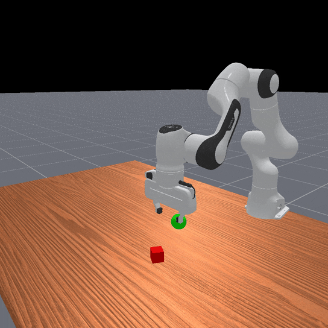
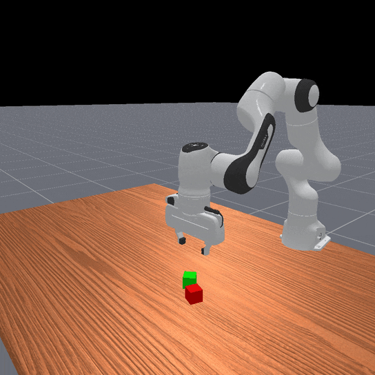
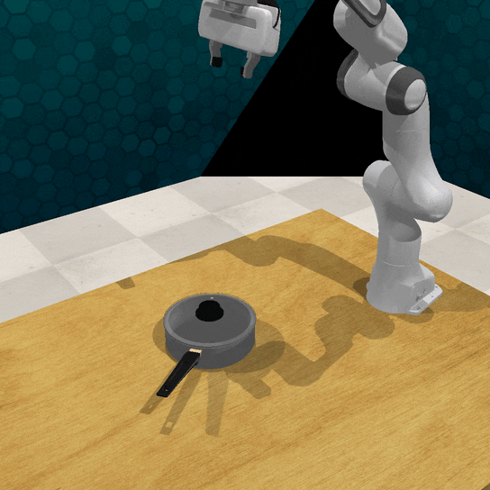
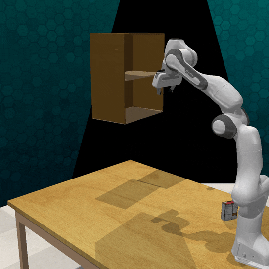

# LLM-TALE

This repository contains the original code for the paper *LLM-Guided Task- and Affordance-Level Exploration in Reinforcement Learning* (LLM-TALE).

## Installation

### Prerequisites: install `uv`

We advice to use uv to install the `llm-tale` package.
Please install `uv` following the [installation instructions](https://github.com/astral-sh/uv?tab=readme-ov-file#installation) if you don't have it installed.

### Prerequisites: setup RLBench (not required for ManiSkill tasks)

Install CoppeliaSim:


```bash
# set env variables
export COPPELIASIM_ROOT=${HOME}/CoppeliaSim
export LD_LIBRARY_PATH=$LD_LIBRARY_PATH:$COPPELIASIM_ROOT
export QT_QPA_PLATFORM_PLUGIN_PATH=$COPPELIASIM_ROOT

wget https://downloads.coppeliarobotics.com/V4_1_0/CoppeliaSim_Edu_V4_1_0_Ubuntu20_04.tar.xz
mkdir -p $COPPELIASIM_ROOT && tar -xf CoppeliaSim_Edu_V4_1_0_Ubuntu20_04.tar.xz -C $COPPELIASIM_ROOT --strip-components 1
rm -rf CoppeliaSim_Edu_V4_1_0_Ubuntu20_04.tar.xz
```

Make sure the env variables are set when you run RLBench experiments and that you can run RLBench headless by following [these instructions](https://github.com/stepjam/RLBench?tab=readme-ov-file#running-headless).

### Install `llm-tale`

Clone:

```bash
git clone git@github.com:llm-tale/llm_tale.git
cd llm_tale
```

Create and source the virtual environment:

```bash
uv venv --python 3.10
source .venv/bin/activate
```

Install:

```bash
uv pip install -e .
```

## Test

To verify your installation you can run:

```bash
pytest tests/test_tasks.py
```

## Tasks

ManiSkill tasks (PickCube, StackCube, PegInsert):
<p align="center">
  
  
  
</p>

RLBench tasks (TakeLid, OpenDrawer, PutBox):
<p align="center">
  
  
  
</p>


## Reproduce results

For LLM-BC run:
```bash
bash scripts/run_llm_bc.sh
```

For LLM-TALE run:
```bash
bash scripts/run_llm_tale.sh
```

## LLM Code generation

To generate or inspect the LLM code, you can check out the `code_generation` notebook under `notebooks`.

## Credits

For the prompt structure, we took inspiration from [DROC](https://github.com/Stanford-ILIAD/droc).

Our TD3 and PPO agents are based on [SKRL examples](https://skrl.readthedocs.io/en/latest/intro/examples.html).

